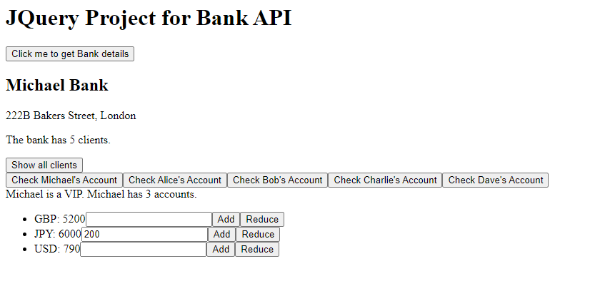

# JQuery Exercise for Bank API

This is a JQuery exercise. It utilises my [Java Bank API](https://github.com/michaelcychan/java-bank-api), another study exercise of building a Web API using Java Spring Boot.  

## Installation

To clone the repo and install:

```bash
git clone git@github.com:michaelcychan/bank-frontend-jquery.git
cd bank-frontend-jquery
npm install
```

To run the application:

```bash
npx reload -b -p 3000
```

## Screenshot

